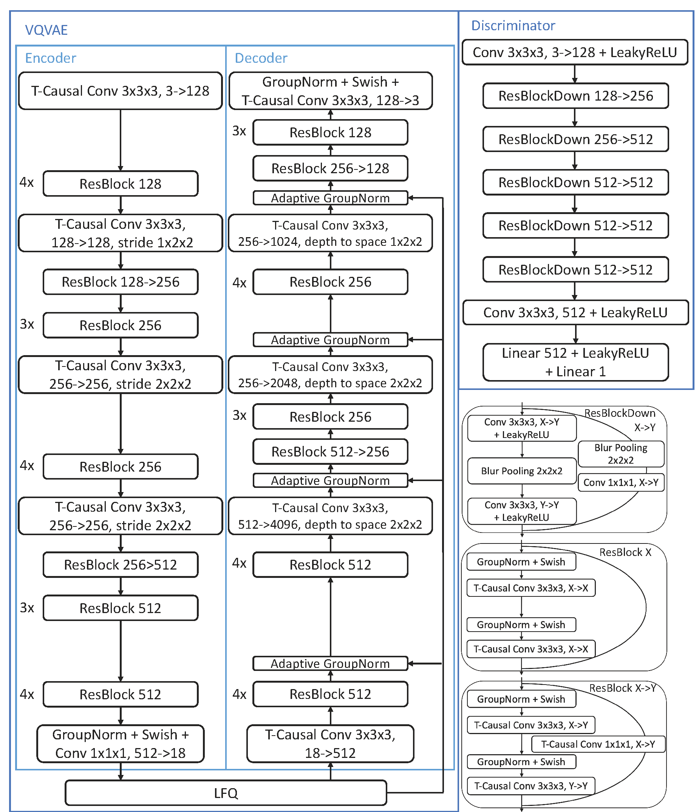

# O2-MAGVIT2
<div align="center">
<figure>


<span style="font-style:italic">Video reconstruction with O2-MAGVIT2-preview (under 720p)</span>
<figure>
</div>

## Introduction
We present an open-source pytorch implementation of Google's MAGVIT-v2 visual tokenizer named O2-MAGVIT2, which stands for handling dual modality (Image and Video) tokenization with a single Tokenizer. O2-MAGVIT2 is aligned with MAGVIT-v2 to a large extent. It uses Lookup-free quantizer(LFQ) with codebook size of $2^{18}$ and the exact same architecture of the encoder, decoder and discriminator described in the original paper. To facilitate training, we use huggingface's accelerate to wrap the trainer.
We also release a preview version of the video tokenizer trained on a Panda-70M subset to validate its performance.

## Architecture
We re-implemented the MAGVIT-v2's architecture exactly. Below is from the [magvit-v2](https://arxiv.org/pdf/2310.05737)'s attachments.

<div align="center">
  
</div>


## Quick start
- **Inference**: edit the arguments in `scripts/run_inference.sh` and run the following command to see the reconstruction result:
  ```bash
  bash scripts/run_inference.sh
  ```
  > run `python inference.py -h` for more details.

- **Training**: edit the config under the `configs/` then run the following command to train the model:
  ```bash
  NODE_RANK=0
  MASTER_ADDR=localhost:25001
  NUM_NODES=1
  NUM_GPUS=8

  bash scripts/run_train_3d.sh $NODE_RANK $MASTER_ADDR $NUM_NODES $NUM_GPUS
  ```


## Training Procedure
The whole training includes two stages. In stage I, we train an image tokenizer with OpenImage dataset (which contains 8M training samples) for 10 epochs with batch size 256. For stage II, we random sampled 9.3M samples from panda-70M and train the video tokenizer for 1 epoch with batch size 128.

## Hyper parameters
We adopt almost the same hyper-parameter setting as MAGVIT-v2 with minimal change. See `configs/magvit2_3d_model_config.yaml` for model setup details and `configs/magvit2_3d_train_config.yaml` for training setup. 

## Pretrained Models
We release a pretrained checkpoint of the video tokenizer on huggingface as a preview. Note that due to much fewer training steps, the model is certainly under-trained and thus may not provide a good enough performance if you use it directly. We recommend considering it a step stone to continue training to get better results.

The checkpoint of O2-MAGVIT2-preview can be found [here](https://huggingface.co/CofeAI/O2-MAGVIT2-preview).

## Acknowledgement
We refer some ideas and implementations from [MAGVIT](https://github.com/google-research/magvit), [vector-quantize-pytorch](https://github.com/lucidrains/vector-quantize-pytorch), [praxis](https://github.com/google/praxis), [LlamaGen](https://github.com/FoundationVision/LlamaGen), [pytorch-image-models](https://github.com/huggingface/pytorch-image-models), and [VQGAN](https://github.com/CompVis/taming-transformers). Thanks a lot for their excellent work.

## Citation
If you found our work interesting, please cite the following references and give us a star.
```
@misc{Fang_O2-MAGVIT2,
author = {Fang, Xuezhi and Yao, Yiqun and Jiang, Xin and Li, Xiang and Yu, Naitong and Wang, Yequan},
license = {Apache-2.0},
title = {O2-MAGVIT2},
year = {2024},
url = {https://github.com/cofe-ai/O2-MAGVIT2}
}
```
